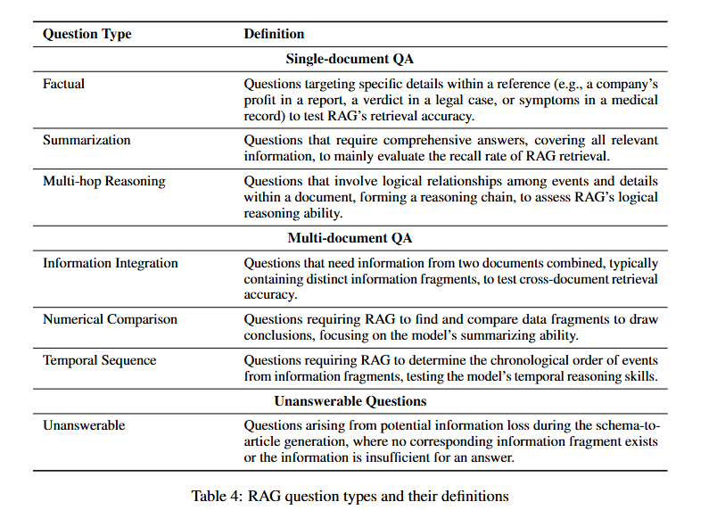

# DragonBall Dataset

The DragonBall dataset is part of the RAGEval framework, designed to evaluate Retrieval-Augmented Generation (RAG) systems in specific scenarios. It serves as a diverse benchmark across finance, law, and medical fields, including texts in both Chinese and English. The dataset focuses on generating high-quality, scenario-specific evaluation data through a schema-driven pipeline.

## Data Overview

The dataset contains over 6,711 questions addressing various query types such as factual questions, multi-hop reasoning, and summarization. It helps evaluate both retrieval and generative capabilities of RAG systems in domain-specific contexts.

## Download Data

Download the dataset from the [RAGEval GitHub repository](https://github.com/OpenBMB/RAGEval/tree/main) and save it under the `data/` folder.

## Data Preprocessing

Preprocessing code is available in [preprocess.py](preprocess.py). The notebook includes steps to filter English entries from the dataset and organize the data in the desired format. 

## Data Structure

### Documents (`dragonball_docs.jsonl`)

Each line in the document file is a JSON object representing a document with the following fields:

- `doc_id`: Unique identifier for the document.
- `title`: Title of the document.
- `content`: Full text content of the document.
- `metadata`: An object containing:
    - `domain`: The domain of the document (e.g., "Finance").
- `content_chunks`: A list of objects, each containing:
    - `para_id`: Unique identifier for the paragraph.
    - `content`: The paragraph text. 

*for now each chunk is the whole document

### Queries (`dragonball_queries_en_processed.jsonl`)

Each line in the query file is a JSON object representing a query with the following fields:

- `doc_id`: Unique identifier for the query.
- `input`: The query text.
- `output`: An object containing:
    - `answers`: List of ground truth answers.
    - `provenance`: List of objects, each containing:
        - `id`: List of relevant document IDs.
        - `text`: List of reference texts used to formulate the answer.
    - `keypoints`: List of key points extracted from the references.
- `metadata`: An object containing:
    - `domain`: The domain of the query (e.g., "Finance").
    - `query_type`: Type of query (e.g., "Factual Question").

## Query Types

The dataset includes various query types to evaluate different aspects of RAG systems:
- **Factual Questions (535)**: These queries seek specific pieces of information, such as dates, names, or definitions.
- **Summary Questions (415)/ Summarization Questions(118)**: These queries involve generating a concise summary of the information contained in one or more documents.
- **Multi-hop Reasoning Questions (532)**: These queries require combining information from multiple documents to generate an answer.
- **Multi-document Information Integration Questions (737)**: These queries require integrating information from multiple documents to answer complex questions.
- **Multi-document Comparison Questions (297)**: These queries involve comparing information across multiple documents.
- **Multi-document Time Sequence Questions (241)**: These queries require understanding the sequence of events across multiple documents.
- **Irrelevant Unsolvable Questions (233)**: These queries are not solvable with the given documents.

These query types help in assessing the retrieval and generative capabilities of RAG systems in handling diverse and complex information needs.

## References

- [RAGEval GitHub Repository](https://github.com/OpenBMB/RAGEval/tree/main)
- [RAGEval Paper](https://arxiv.org/pdf/2408.01262)